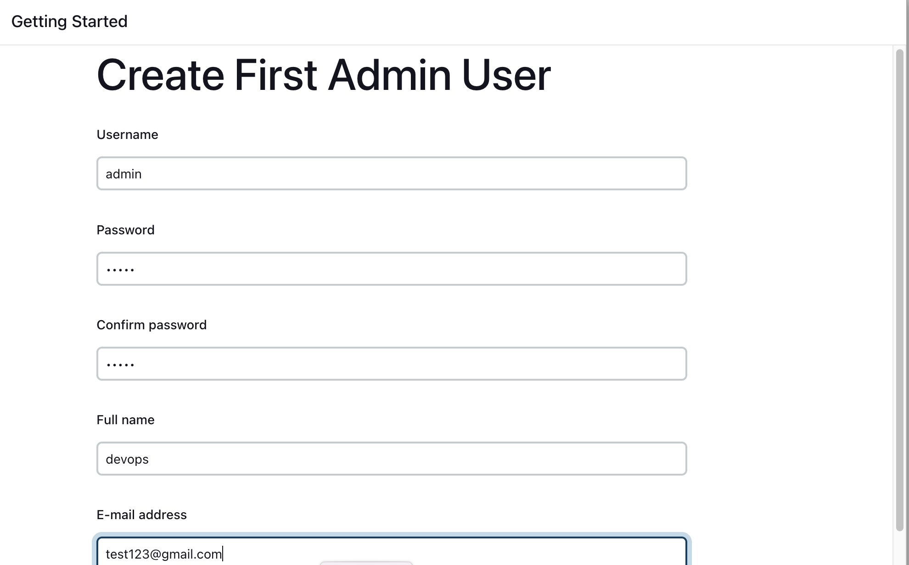
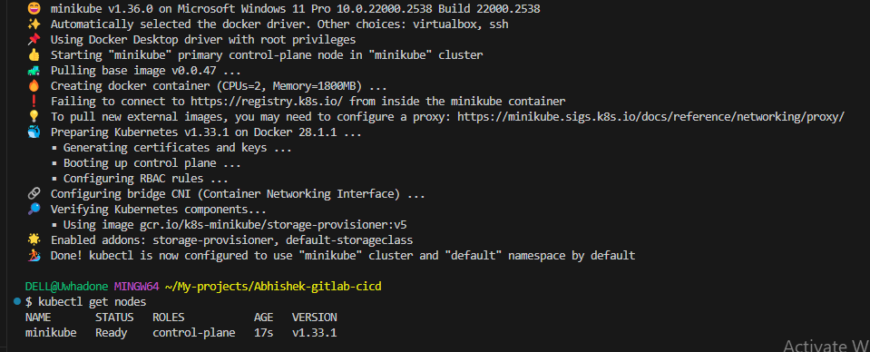
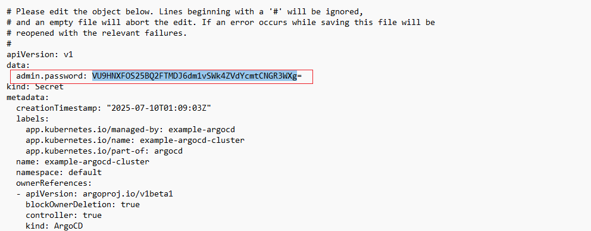

# Jenkins Pipeline for Java-based application using Maven, SonarQube, Argo CD and Kubernetes


Here are the step-by-step details to set up an end-to-end Jenkins pipeline for a Java application using SonarQube, Argo CD, Helm, and Kubernetes:

## Prerequisites:

   -  Java application code hosted on a Git repository
   -  Jenkins server
   -  Kubernetes cluster
   -  Argo CD
   -  Github account and repository (your Spring Boot app should be in Github: you can fork or clone mine)
   -  AWS EC2 instance (Ubuntu 22.04 LTS, t2.large, security group open to ports 22, 433, 8080, 9000, and 30,000-60,000)
   -  A domain/subdomain (optional) if you want to expose SonarQube externally.
   -  Basic knowledge of Git, Maven, Docker and Linux commands
   -  SSH client for connecting to an EC2 instance


## Steps:

 Jenkins Zero to Hero: A Complete CI/CD Pipeline with GitLab, SonarQube, Docker, Argo CD and Kubernetes

Looking to master Jenkins from scratch? This guide takes you from installation to building a full end-to-end CI/CD pipeline using GitLab, Docker, and SonarQube — all hosted on an AWS EC2 instance.
A complete, step-by-step guide to implement a GitLab CI/CD pipeline to:
✅ Deploy a Spring Boot Java application
 ✅ Use EC2 t2.large instance as the server to host Jenkins and Sonarqube
 ✅ Use Maven Docker image for builds
 ✅ Host a SonarQube dashboard on the same EC2 instance


### Installation on EC2 Instance

Install Jenkins, configure Docker as an agent, set up cicd, deploy applications to Kubernetes and much more.
AWS EC2 Instance

#### STEP 1: Launch & Prepare EC2 Instance

First, you need to fork the source code of this project from my  GitLab repo. You can download it onto your local machine by running the command “git clone https://github.com/Uwadon1/Jenkins-Zero-To-Hero”, and then cd into the directory. All the necessary codebase for this project is in this directory ‘java-maven-sonar-argocd-helm-k8s’.


a. Launch an Ubuntu EC2 (t2.large)

Navigate to the AWS console and launch an instance. We will launch an Ubuntu instance that will serve as the runner, and give it the name “Jenkins-server” and select the AMI server to be Ubuntu Server 22.04 LTS 


We will select the instance type t2.medium and make use of an existing keypair named “devopsapp”  and leave the network settings as default.


We will leave the other options as default and click launch instance (we will leave the Security group setting for now and come back to make necessary adjustments to our S.G)


We will navigate to the SG overview page to make the manual adjustments to our security group settings to allow necessary traffic.
We will open the following traffic and allow access to IPv4 anywhere:


22 (SSH)
80 (Http)
443 (Https)
8080 (Jenkins)
9000 (SonarQube)
30,000 - 60,000 (Kubernates pods)


b. SSH into the instance
Now we will SSH into the instance we just created, using the command below:
`ssh -i ~/.ssh/devopsapp.pem ubuntu@34.222.49.10` (ensure to replace with your instance IP address)


c. Update and install dependencies
We will first need to update the instance using the command “sudo apt update” Next, we will install JDK, which is a prerequisite for installing Jenkins, using the command “sudo apt install openjdk-17-jre”
`sudo apt update`


`sudo apt install openjdk-17-jre-y`


Verify Java is Installed
`Java -version`


Now, you can proceed with installing Jenkins
```
curl -fsSL https://pkg.jenkins.io/debian/jenkins.io-2023.key | sudo tee \
  /usr/share/keyrings/jenkins-keyring.asc > /dev/null
echo deb [signed-by=/usr/share/keyrings/jenkins-keyring.asc] \
  https://pkg.jenkins.io/debian binary/ | sudo tee \
  /etc/apt/sources.list.d/jenkins.list > /dev/null
sudo apt-get update
sudo apt-get install jenkins
```


NB: By default, Jenkins will not be accessible to the external world due to the inbound traffic restriction by AWS. Ensure port 8080 is open in the inbound traffic rules.
Log in to Jenkins using the URL below:
http://ec2-instance-public-ip-address:8080 [You can get the ec2-instance-public-ip-address from your AWS EC2 console page]
http://54.245.159.36:8080

After you log in to Jenkins, run the command in your terminal to copy the Jenkins Admin Password - `sudo cat /var/lib/jenkins/secrets/initialAdminPassword`, then enter the Administrator password that was cated earlier in your terminal


Click on Install suggested plugins


Wait for Jenkins to install the suggested plugins


Create First Admin User or Skip the step [If you want to use this Jenkins instance for future use-cases as well, it is better to create an admin user]




Jenkins Installation is Successful. You can now start using Jenkins


Install the Docker Pipeline plugin in Jenkins:
The first thing we will create is a job, we will select create new, and then type in the name we want to give our job and select pipeline and click okay


To create our first pipeline, we will need to select the pipeline script from the SCM option. Input your repo URL and path, also indicate the branch of your repo, if it’s master or main.


We will need to install some necessary plugins in our Jenkins, go to Manage Jenkins, and under that, go to Manage Plugins.

In the Available tab, search for "Pipeline Stage view, Docker Pipeline, and Sonarqube Scanner”. Select the plugins and click the Install button. Afterwards, restart Jenkins after the plugins are installed.


#### STEP 2: Set up and Configure SonarQube on EC2

To install SonarQube, we need to ensure Java is already installed.
The next thing we will have to do is move to the root directory, so that we can have admin privileges, using the commands below:

```
sudo su -
apt install unzip
```


```
adduser sonarqube
sudo su - sonarqube
```


`wget https://binaries.sonarsource.com/Distribution/sonarqube/sonarqube-9.4.0.54424.zip
unzip *`


```
chmod -R 755 /home/sonarqube/sonarqube-9.4.0.54424
chown -R sonarqube:sonarqube /home/sonarqube/sonarqube-9.4.0.54424
cd sonarqube-9.4.0.54424/bin/linux-x86-64/
./sonar.sh start
```

We can verify the status of SonarQube via this command: `./sonar.sh status`


Wait for SonarQube to start (2-3 minutes), then access your SonarQube on your browser via http://34.222.49.10:9000/ {ensure to input your EC2 IP address)
The Default login details will be: admin/admin. You will need to change the default password to a new one in the next tab.


Next, we will generate a Sonar Token. To do that, navigate to ‘my account’ at the top right corner, then go to the settings tab, and click on generate token to generate a token to allow gitlab cicd communicate with your SonarQube server.
API key= 7b21dedad46ea53e748d579d2a887de848295ef3


To make Jenkins able to connect to SonarQube, we need to input the token into the Jenkins credentials

We will navigate to the ‘manage Jenkins’, then credentials, then systems, then global credentials and click add new credentials.


Docker Slave Configuration
We will have to install Docker, and we’ll do that by running the following commands:
```
sudo apt update
sudo apt install docker.io -y
```


Grant Jenkins user and Ubuntu user permission to the Docker daemon.
Next, we will grant permission to the Ubuntu user and the Jenkins user to be able to access Docker Daemon, and afterwards, we will restart Docker
```
usermod -aG docker jenkins
usermod -aG docker ubuntu
systemctl restart docker
```


Once you are done with the above steps, it is better to restart Jenkins.
http://<ec2-instance-public-ip>:8080/restart
http://54.245.159.36:8080/restart
The Docker agent configuration is now successful.

How to Build and Use
1. Build the image:
   ```bash
   docker build -t maven-uwadon1-docker-agent:v1 .
   ```
2. Verify it matches the original:
   ```bash
   docker run -it --rm maven-uwadon1-docker-agent:v1 bash -c "mvn --version; docker --version; java --version
   ```
3. Push to your registry:
   ```bash
   docker tag maven-uwadon1-docker-agent:v1 uwadon01/maven-uwadon1-docker-agent:v1
   docker push uwadon01/maven-uwadon1-docker-agent:v1

   ```
   Here is my Jenkinsfile pipeline:

```
pipeline {
  agent {
    docker {
      image 'uwadon01/maven-uwadon1-docker-agent:v1'
      args '--user root -v /var/run/docker.sock:/var/run/docker.sock' // mount Docker socket to access the host's Docker daemon
    }
  }
  stages {
    stage('Checkout') {
      steps {
        sh 'echo passed'
        //git branch: 'main', url: 'https://github.com/Uwadon1/Jenkins-Zero-To-Hero.git'
      }
    }
    stage('Build and Test') {
      steps {
        sh 'ls -ltr'
        // build the project and create a JAR file
        sh 'cd java-maven-sonar-argocd-helm-k8s/spring-boot-app && mvn clean package'
      }
    }
    stage('Static Code Analysis') {
      environment {
        SONAR_URL = "http://34.222.49.10:9000"
      }
      steps {
        withCredentials([string(credentialsId: 'sonarqube', variable: 'SONAR_AUTH_TOKEN')]) {
          sh 'cd java-maven-sonar-argocd-helm-k8s/spring-boot-app && mvn sonar:sonar -Dsonar.login=$SONAR_AUTH_TOKEN -Dsonar.host.url=${SONAR_URL}'
        }
      }
    }
    stage('Build and Push Docker Image') {
      environment {
        DOCKER_IMAGE = "uwadon01/ultimate-cicd:${BUILD_NUMBER}"
        // DOCKERFILE_LOCATION = "java-maven-sonar-argocd-helm-k8s/spring-boot-app/Dockerfile"
        REGISTRY_CREDENTIALS = credentials('docker-cred')
      }
      steps {
        script {
            sh 'cd java-maven-sonar-argocd-helm-k8s/spring-boot-app && docker build -t ${DOCKER_IMAGE} .'
            def dockerImage = docker.image("${DOCKER_IMAGE}")
            docker.withRegistry('https://index.docker.io/v1/', "docker-cred") {
                dockerImage.push()
            }
        }
      }
    }
    stage('Update Deployment File') {
        environment {
            GIT_REPO_NAME = "Jenkins-Zero-To-Hero"
            GIT_USER_NAME = "Uwadon1"
        }
        steps {
            withCredentials([string(credentialsId: 'github', variable: 'GITHUB_TOKEN')]) {
                sh '''
                    git config user.email "uwadon1@gmail.com"
                    git config user.name "Uwadone Joshua"
                    BUILD_NUMBER=${BUILD_NUMBER}
                    sed -i "s/replaceImageTag/${BUILD_NUMBER}/g" java-maven-sonar-argocd-helm-k8s/spring-boot-app-manifests/deployment.yml
                    git add java-maven-sonar-argocd-helm-k8s/spring-boot-app-manifests/deployment.yml
                    git commit -m "Update deployment image to version ${BUILD_NUMBER}"
                    git push https://${GITHUB_TOKEN}@github.com/${GIT_USER_NAME}/${GIT_REPO_NAME} HEAD:main
                '''
            }
        }
    }
  }
}
```

Let’s walk through the Jenkins Pipeline (Jenkinsfile) step-by-step with detailed explanations of each section, assuming you're trying to understand it from a DevOps/CI/CD beginner’s point of view.

🔁 Overall Purpose of This Pipeline

This Jenkins pipeline:
Uses a Docker-based agent with Maven.


Checks out the code.


Builds a Java Spring Boot app.


Runs static code analysis using SonarQube.


Builds and pushes a Docker image to Docker Hub.


Updates the Kubernetes deployment YAML file with the new image tag.


Pushes the updated manifest to GitHub.


🧱 Pipeline Breakdown
```
pipeline {
  agent {
    docker {
      image 'uwadon01/maven-uwadon1-docker-agent:v1'
      args '--user root -v /var/run/docker.sock:/var/run/docker.sock'
    }
  }
```

🔹 Agent Section
docker { ... }: Tells Jenkins to run the entire pipeline inside a Docker container.


image: Uses a custom Maven Docker image as the build environment.


args:


--user root: Runs the container as root so it can use Docker commands inside.


-v /var/run/docker.sock:/var/run/docker.sock: Mounts the host Docker socket inside the container. This allows the container to run Docker commands on the host.


🚦 Stages
```
Stage 1: Checkout
stage('Checkout') {
  steps {
    sh 'echo passed'
    //git branch: 'main', url: 'https://github.com/Uwadon1/Jenkins-Zero-To-Hero.git'
  }
}
```

Simply echoes "passed" for now.


The commented git line shows you would normally pull code from GitHub here.


```
Stage 2: Build and Test
stage('Build and Test') {
  steps {
    sh 'ls -ltr'
    sh 'cd java-maven-sonar-argocd-helm-k8s/spring-boot-app && mvn clean package'
  }
}
```

Lists files in the current directory (ls -ltr) – mostly for debugging.


Then navigate into the Spring Boot project folder and build the project using Maven:


mvn clean package: Cleans old builds and packages the application (creates .jar file).


#### Stage 3: Static Code Analysis
```
environment {
  SONAR_URL = "http://54.245.159.36:9000"
}
steps {
  withCredentials([string(credentialsId: 'sonarqube', variable: 'SONAR_AUTH_TOKEN')]) {
    sh 'cd java-maven-sonar-argocd-helm-k8s/spring-boot-app && mvn sonar:sonar -Dsonar.login=$SONAR_AUTH_TOKEN -Dsonar.host.url=${SONAR_URL}'
  }
}
```

SonarQube is used to scan code for bugs, vulnerabilities, and code smells.


It:


Uses credentials stored in Jenkins (sonarqube) to log in to the SonarQube server.


Runs a Maven Sonar analysis with the login token and URL.


#### Stage 4: Build and Push Docker Image
```
environment {
  DOCKER_IMAGE = "uwadon01/ultimate-cicd:${BUILD_NUMBER}"
  REGISTRY_CREDENTIALS = credentials('docker-cred')
}
steps {
  script {
    sh 'cd java-maven-sonar-argocd-helm-k8s/spring-boot-app && docker build -t ${DOCKER_IMAGE} .'
    def dockerImage = docker.image("${DOCKER_IMAGE}")
    docker.withRegistry('https://index.docker.io/v1/', "docker-cred") {
        dockerImage.push()
    }
  }
}
```

Builds a Docker image of the Spring Boot app using the current build number as the tag.


Pushes the image to Docker Hub using stored credentials (docker-cred).


#### Stage 5: Update Deployment File
```
environment {
  GIT_REPO_NAME = "Jenkins-Zero-To-Hero"
  GIT_USER_NAME = "Uwadon1"
}
steps {
  withCredentials([string(credentialsId: 'github', variable: 'GITHUB_TOKEN')]) {
    sh '''
      git config user.email "uwadon1@gmail.com"
      git config user.name "Uwadone Joshua"
      BUILD_NUMBER=${BUILD_NUMBER}
      sed -i "s/replaceImageTag/${BUILD_NUMBER}/g" java-maven-sonar-argocd-helm-k8s/spring-boot-app-manifests/deployment.yml
      git add java-maven-sonar-argocd-helm-k8s/spring-boot-app-manifests/deployment.yml
      git commit -m "Update deployment image to version ${BUILD_NUMBER}"
      git push https://${GITHUB_TOKEN}@github.com/${GIT_USER_NAME}/${GIT_REPO_NAME} HEAD:main
    '''
  }
}
```

Updates the Kubernetes deployment YAML file:


Replace replaceImageTag in the YAML with the current build number using sed.


Then commits and pushes the updated manifest back to the GitHub repo using a GitHub token.


✅ Summary – What You Achieve
Step
Action
Checkout
(Placeholder for pulling source code)
Build and Test
Builds the app using Maven
Static Code Analysis
Scans the code using SonarQube
Build and Push Docker Image
Creates Docker image and pushes to Docker Hub
Update Deployment File
Updates and pushes the Kubernetes manifest with a new image tag

NB: Remember to change your Sonarqube URL to reflect the IP address of your EC2 instance, and change other secret variables to reflect yours

We will start the Kubernetes cluster on minikube using this command: 
`minikube start --driver=hyperv`

Alternatively: minikube config set memory 1800
`minikube start`



And verify using these commands:
```
kubectl get nodes
minikube status
```


We will run the installation of Argo CD  using ‘operator’ https://operatorhub.io/. When brought to the dashboard, we will search for Argo CD and click on install


Step 1

Install Operator Lifecycle Manager (OLM), a tool to help manage the Operators running on your cluster.
```
curl -sL https://github.com/operator-framework/operator-lifecycle-manager/releases/download/v0.32.0/install.sh | bash -s v0.32.0
```


Step 2
Install the operator by running the following command:
```
kubectl create -f https://operatorhub.io/install/argocd-operator.yaml
```

This Operator will be installed in the "operators" namespace and will be usable from all namespaces in the cluster.


Step 3.
After installation, watch your operator come up using the next command.

`kubectl get pods -n operators`
To use it, check out the custom resource definitions (CRDs) introduced by this operator to start using it.


Now, we need to include the other secret variables into our Jenkins credentials (Github token and Dockerhub username and password)


While we wait for the Argo CD part, we will go ahead and run the CI part in Jenkins and watch the logs in the pipeline build. Other things being equal, the pipeline should run successfully if we set all our variables and secrets right.


We can also see the test result in our Sonar server


Next, from your operator.io go to the Argo CD documentation: https://argocd-operator.readthedocs.io/en/latest/ and go to usage/basics. And copy out the following command:
```
apiVersion: argoproj.io/v1alpha1
kind: ArgoCD
metadata:
  name: example-argocd
  labels:
    example: basic
spec: {}
```

And input it into any file, e.g, argocd-basic.yml and save. Next, we run the command to execute the file:
Make sure the namespace argocd exists; if not, create it  with this command:
kubectl create namespace argocd
Now we can run the Kubernetes command:

`kubectl apply -f argocd-basic.yml`

We can check the pods running via this command:  
`kubectl get pods`
We can also check the service by running: `kubectl get svc`


Before we proceed to the next step, we have to run: `kubectl edit svc example-argocd-server`. To convert the svc port from Cluster IP to NodePort, so that our application in Kubernetes can be accessed within the same organization.


In order to access the Argo CD on our browser, we will have to run this command: `minikube service example-argocd-server`. We should see the URL to access the ArgoCD UI dashboard.


To get the password, we will run `kubectl get secrets`. Note: Argo stores the secret in “example-argocd-cluster“ 
You will see the output below


Next, we will run this command to reveal the secret:
`kubectl edit secret example-argocd-cluster`. You will copy out the secret ass hown below



Because Kubernates secrets are encrypted and would need to be decoded, run this command to reveal it, this will be your password into the Argo CD UI, note the default username is admin:


If the username and password input are successful, you should see the argocd homepage. Next, we will click on create Application.


We will fill in the necessary details to launch our application, for the Application Name: choose test and for the Project Name choose default. In the repository URL, input the URL of your repo, e.g, https://github.com/Uwadon1/Jenkins-Zero-To-Hero and the part should be: java-maven-sona-argocd-helm-k8s/spring-boot-app-manifests and for the namespace, write default. When done, click create


As shown below, once you hit create, Argo CD will sync automatically and will give you the output of your deployment


This comprehensive guide should help you set up a complete end-to-end Jenkins CI/CD pipeline for your Spring Boot application with SonarQube, Maven, Kubernetes and Argo CD. 
